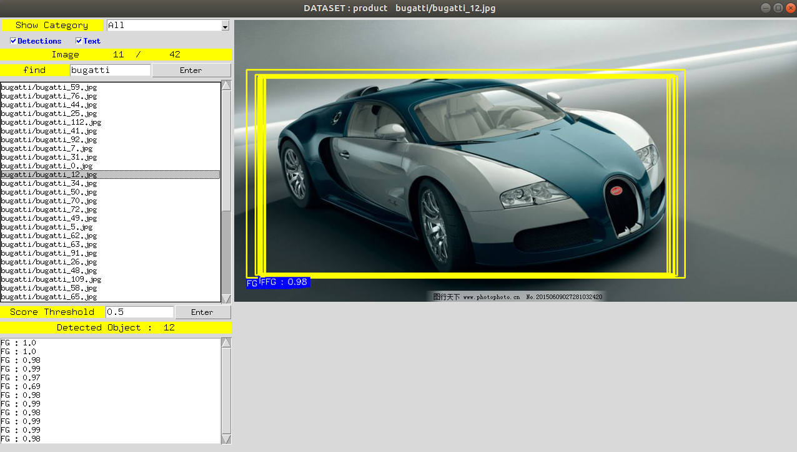
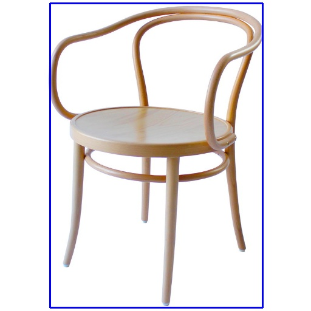
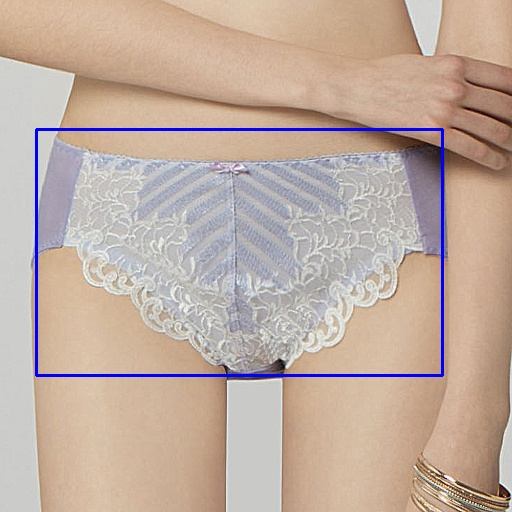
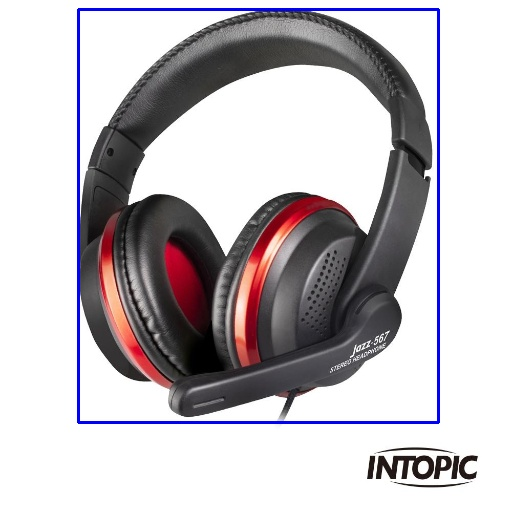
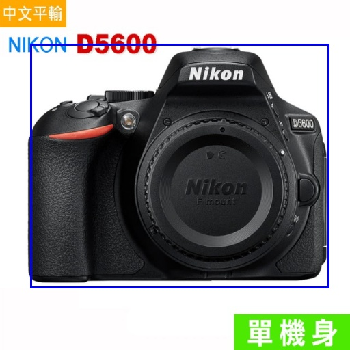

# R-FCN-3000

# Installation Guide

git clone -b cvpr3k --single-branch https://github.com/bigchou/SNIPER.git

see https://docs.google.com/document/d/1MutrvFh9y3RMx4yuUDfN2pjTOvVt7deckndP-Ym106I/edit?usp=sharing

#### Note. this repo is for python2 only

# Execution

### make dataset

~~~~
python mydemo.py
~~~~

### predict real-shot images

~~~~
# Drawing
python run.py --mode draw --topk 5
# Cropping
python run.py --mode crop --topk 1
# Disable non-maximum suppression (NMS)
python run.py --nonms --mode crop --topk 1
~~~~

#### Note.

1. [OPTION] Please donwload these images https://drive.google.com/drive/folders/1KU6bBvjYIDDJh-ry8t5BOKlthchFD7G1?usp=sharing and put it in <b>demo/</b>

# Visualize detection results using DetVisGUI provided by <a href="https://github.com/Chien-Hung/DetVisGUI">Chien-Hung</a>

# Results
see <b>myoutput</b> for more details.

<table>
 <tr>
 <td></td>
 <td></td>
 <td></td>
 <td></td>
 <td></td>
 <td></td>
 <td></td>
 <td></td>
 <td></td>
 <td></td>
 <td></td>
 </tr>
</table>

# Note.

[1] Remember to do <b>git push origin cvpr3k</b>

[2] Extract files using <b>cat yahoo.part* | tar zxvf -</b>

[3] zip -r -qq pchomefcncrop.zip products-pchome products-pchome.json
